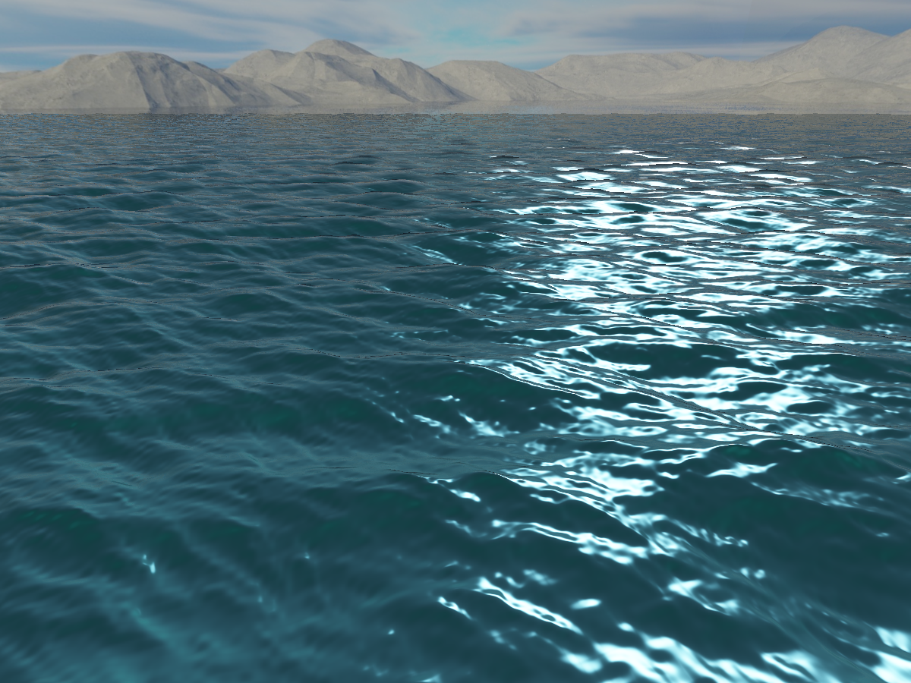
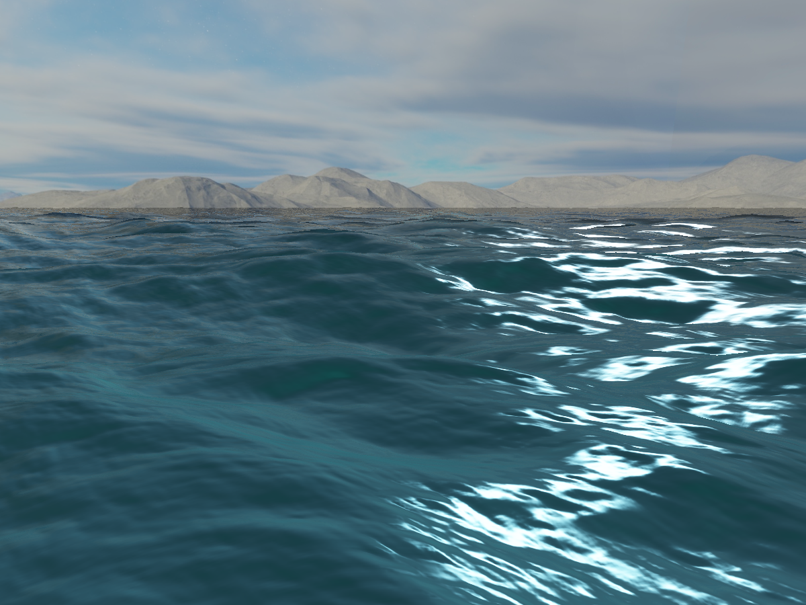

# Ocean Rendering

## Description

Rendering ocean water in OpenGL utilizing J. Tessendorf's inverse Fourier transform rendered via a projected grid (C. Johanson).
Featuring deferred lighting with Physically Based Rendering (PBR) and Image Based Lighting (IBL) technology.

## Images

## Background

After deciding to make a ship game, I began research on better ways to render ocean water, which led me to the listed papers. I implemented the content of the papers on top of my at-the-time current engine [nx-engine](https://github.com/forenoonwatch/nx-engine). This was utilized in my subsequent attempts at water-related rendering and always traveled in my game engine repositories such as [block-systems](https://github.com/forenoonwatch/block-systems).

## Features

- GPU accelerated IFFT ocean, using the Phillips spectrum as per Jerry Tessendorf's paper "Simulating Ocean Water"
- Projected grid world model based on Claes Johanson's paper
- OpenGL implementation of PBR and IBL

## Future Work

- Underwater rendering
- Lighting volumes
- Merge with main engine
- Add improved post processing effects
- Improve configurability
- Optimize rendering/calculation
- Code clean up
- Further fill out readme
- Add pictures to readme

## Building / Usage

Uses GCC and GNU Make. Good luck.

## Dependencies

- GLFW
- Glew
- GLM
- Assimp
- STB Image

